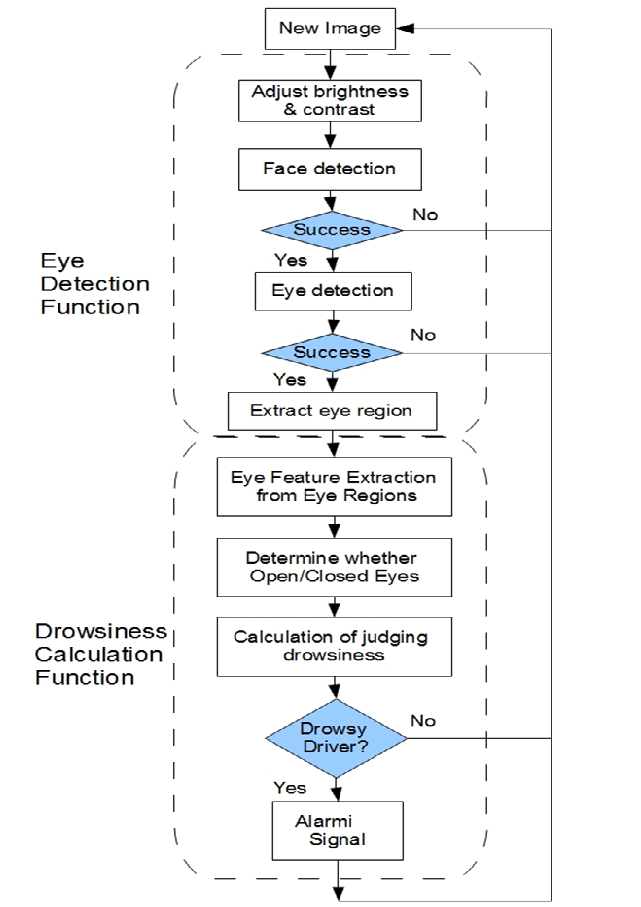
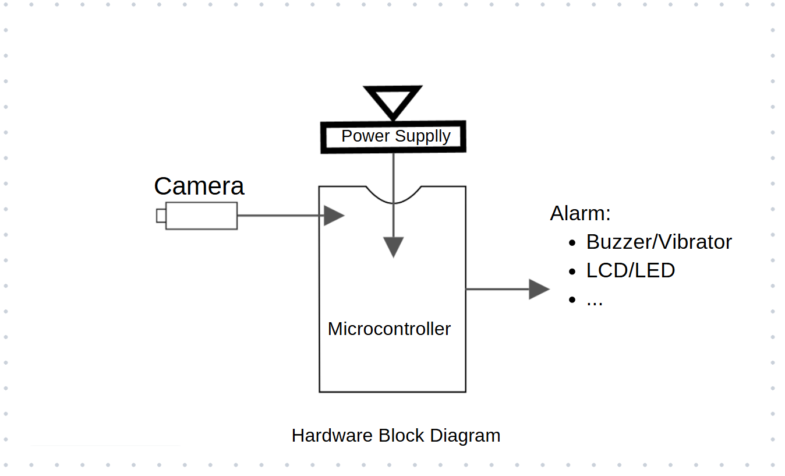
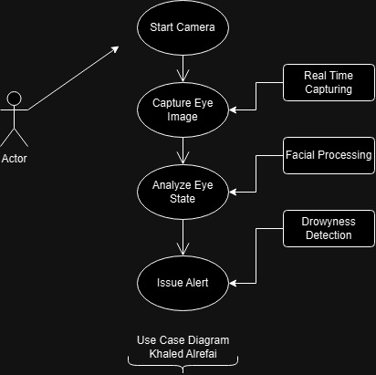
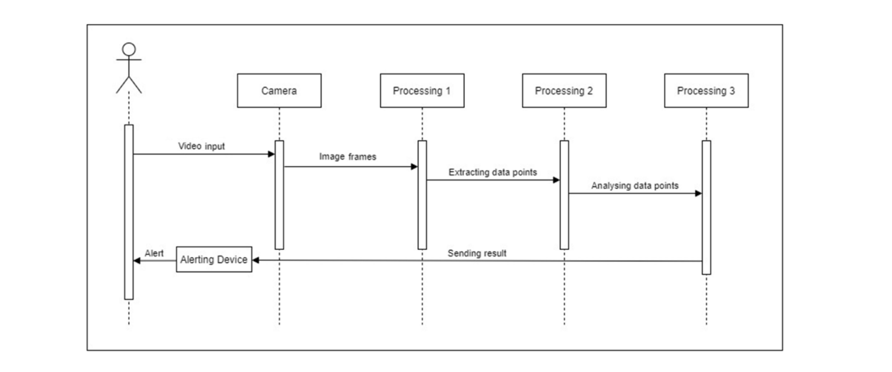
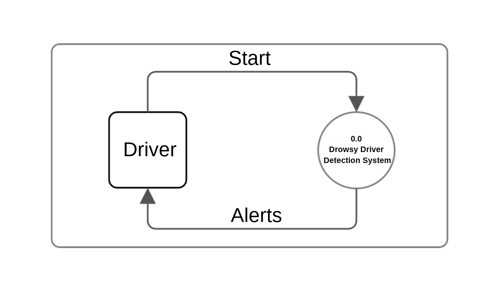
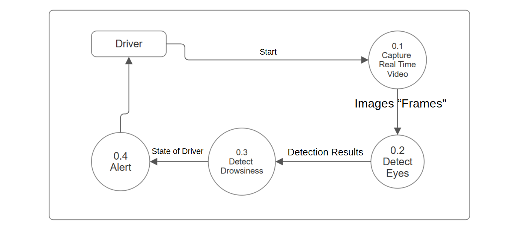
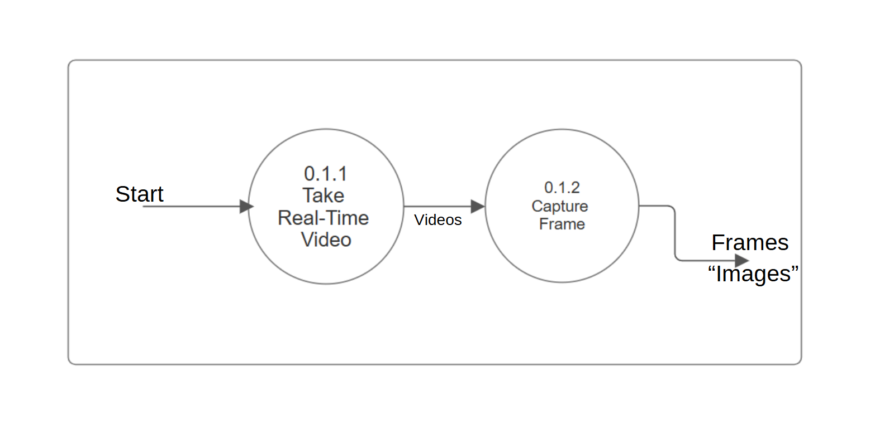
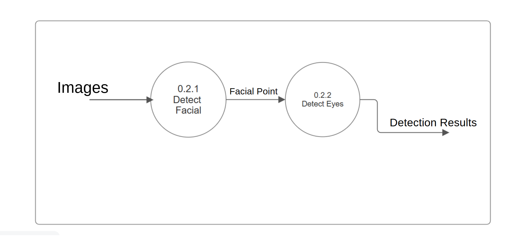

# Driver-Drowsiness-Detection-System
 Drowsy Driver Detection Device  Powered by TinyML model 
# Driver Drowsiness Detection System

## 🚗 Overview
The **Driver Drowsiness Detection System (DDDS)** is an AI-powered concept aimed at detecting signs of drowsiness in drivers using **TinyML** models. The system monitors eye activity in real-time and triggers alerts (sound, vibration, or light) when signs of fatigue are detected.  

This project was developed as part of the **Computer Engineering Design** course at **Istanbul Okan University**, under the supervision of **Prof. Emel Koç**.

🔗 **GitHub Repository**: [Driver Drowsiness Detection System](https://github.com/Kaldx5/Driver-Drowsiness-Detection-System.git)

## 🎯 Features
- **Real-Time Eye Monitoring**: Detects drowsiness based on eye closure patterns.
- **TinyML Integration**: Optimized for **low-power microcontrollers** like Raspberry Pi, Arduino, or ESP32.
- **Standalone System**: Operates **without internet connectivity** for privacy and reliability.
- **Low Power Consumption**: Designed for battery-powered operation.
- **Customizable Alerts**: Configurable buzzer, LED, or vibration feedback.
- **Scalable & Adaptable**: Supports multiple hardware configurations.

---

## 🏛️ System Architecture
This project follows an **edge computing approach**, where all computations are performed **locally** on a microcontroller.

### 🖥️ Workflow Diagram

### 📡 Hardware Block Diagram

---

## 📊 UML Diagrams
### 🔹 Use Case Diagram

### 🔹 Sequence Diagram

### 🔹 Data Flow Diagrams (DFD)
#### Level 0

#### Level 1

#### Level 2 - Capture Real-Time Video

#### Level 2 - Detect Face and Eyes

---

## 🛠️ Design Considerations
### ✅ **Real-Time Processing**
- The system processes eye-state data in **real-time** to prevent accidents.
- Low-latency detection (<1 second) ensures **fast alert responses**.

### 🔒 **Privacy & Offline Operation**
- No internet connectivity is required.
- All processing is done **locally** on the microcontroller for **data security**.

### 🔄 **Scalability & Adaptability**
- Supports **multiple microcontroller architectures** (ESP32, Raspberry Pi, Arduino).
- Can be **integrated into different vehicle types**, from personal cars to commercial fleets.

### 🔋 **Energy Efficiency**
- Optimized for **battery-powered operation**.
- Uses **low-power TinyML models** for continuous monitoring.

---

## 🧪 Testing Approach
- **Unit Testing**: Test individual modules (image processing, detection algorithm, alert system).
- **Integration Testing**: Ensure seamless communication between hardware components.
- **Performance Testing**: Verify that the detection system operates with **<1s latency**.
- **Environmental Testing**: Test system behavior under **various lighting conditions**.

---

## 🔮 Future Enhancements
- 📡 **IoT Integration**: Remote monitoring via cloud-based logging.
- 🏅 **Advanced ML Models**: Improve accuracy using deep learning.
- 🎙 **Voice Alerts**: Audio notifications for driver warnings.
- 🕶 **Enhanced Vision System**: Infrared-based night vision for low-light driving.

---

## 📚 References
1. Khaled Alrefai, **"Driver Drowsiness Detection System"** - [Software Design Document (SDD)](docs/SDD.pdf)
2. Khaled Alrefai, **"Driver Drowsiness Detection System"** - [Software Requirements Specification (SRS)](docs/SRS.pdf)
3. Khaled Alrefai, **"Driver Drowsiness Detection System"** - [Project Proposal](docs/Proposal.pdf)
4. **TinyML Model for Edge AI Processing** - [TensorFlow Lite Documentation](https://www.tensorflow.org/lite)
5. **OpenCV for Image Processing** - [OpenCV Documentation](https://opencv.org/)

### 🔗 External References:
1. **TinyML Model for Edge AI Processing** - [TensorFlow Lite Documentation](https://www.tensorflow.org/lite)
2. **OpenCV for Image Processing** - [OpenCV Documentation](https://opencv.org/)
3. **Driver Drowsiness Detection Research Paper** - [IEEE Xplore](https://ieeexplore.ieee.org/document/8982938)
4. **Machine Learning on Microcontrollers** - [Seeed Studio Blog](https://www.seeedstudio.com/blog/machine-learning-on-microcontrollers/)

---

## 📞 Contact
👤 **Khaled Alrefai**  
📧 Email: [khaled@eng-alrefai.com](mailto:khaled@eng-alrefai.com)  
🔗 LinkedIn: [linkedin.com/in/khaled-alrefai-668079273/](https://www.linkedin.com/in/khaled-alrefai-668079273/)

---

⭐ **If you find this project useful, please consider starring the repository!** ⭐
